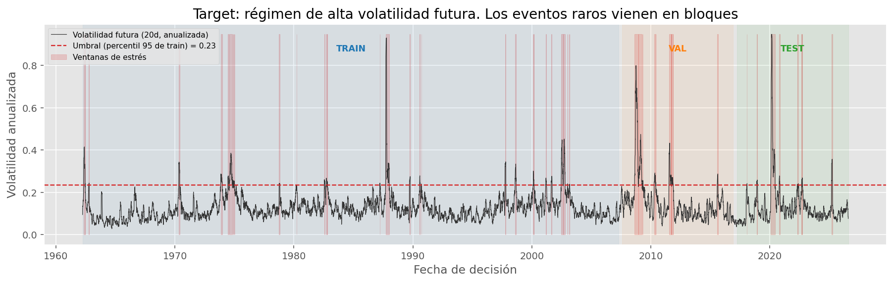
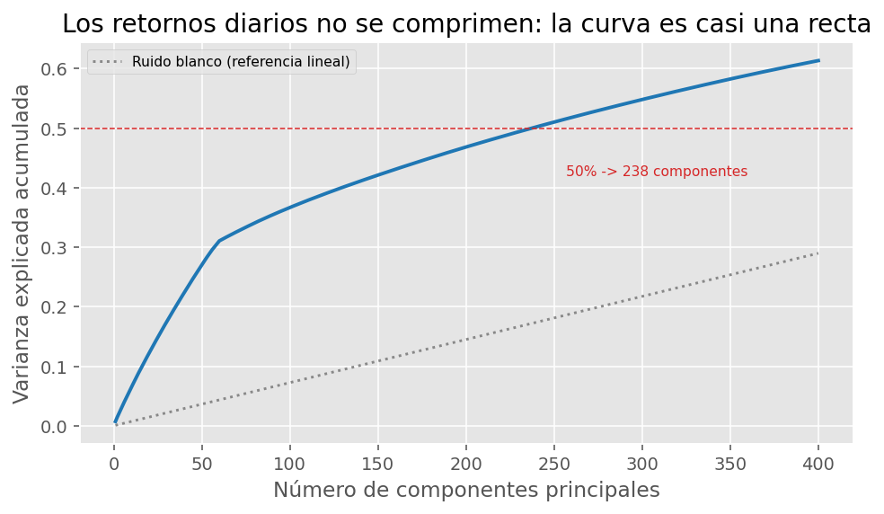
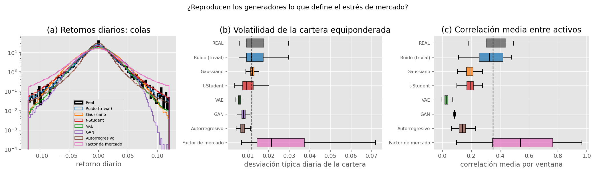
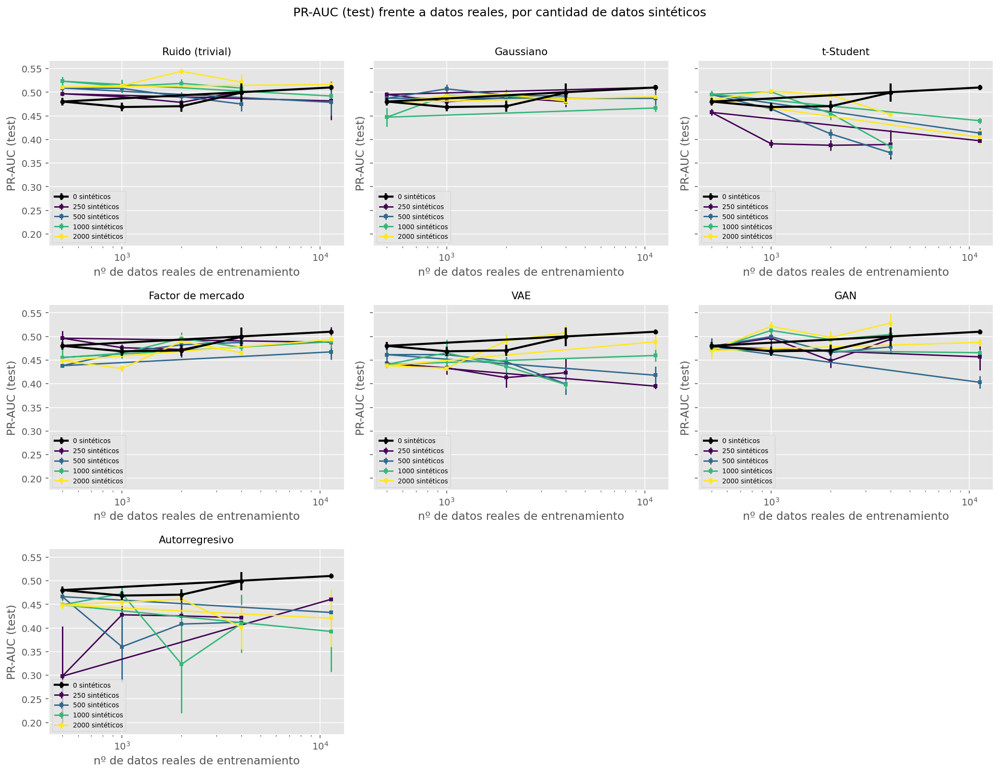
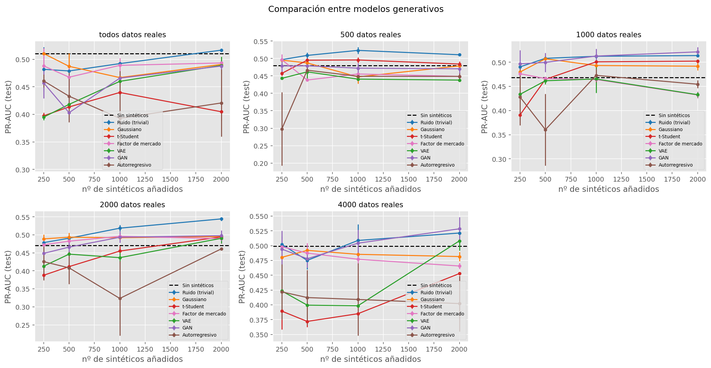
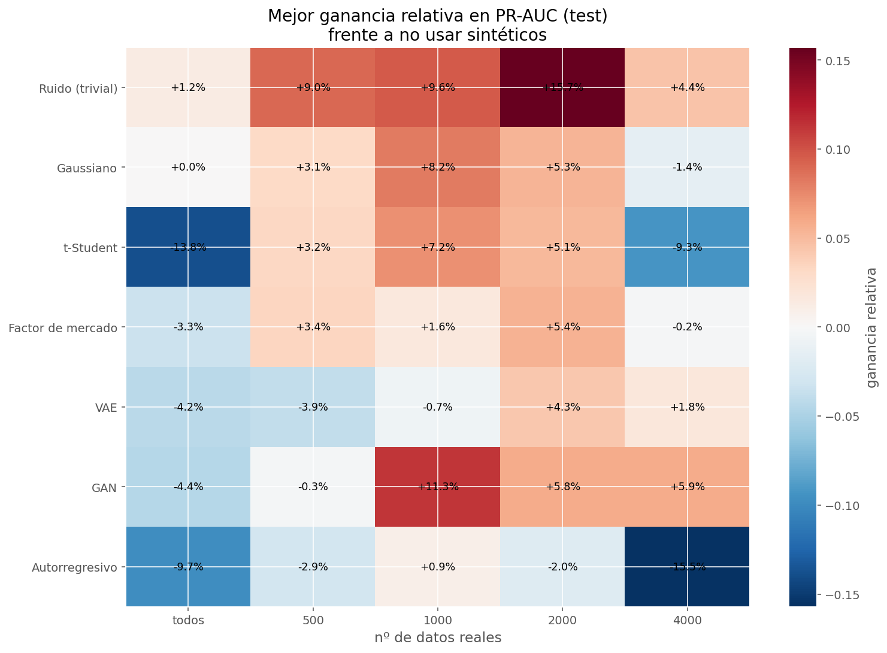
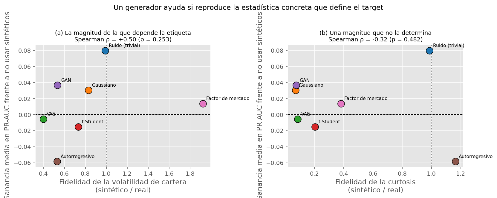
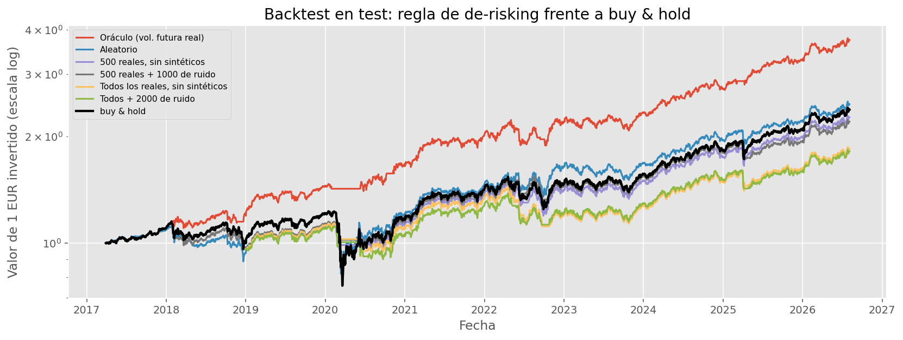

# Taller B5-T1 · Generación de datos financieros sintéticos para predicción de estrés de mercado

**Pregunta que responde este trabajo:** ¿pueden los modelos generativos mejorar el rendimiento de un modelo de
machine learning aumentando sus datos de entrenamiento?

**Respuesta corta:** sí, pero **condicionalmente**. La ganancia va de **+15,7%** en PR-AUC con datos reales escasos
a **+1,2%** (indistinguible de cero) con todos los datos. Los generadores que ganan son los que reproducen la
volatilidad de la cartera (el trivial de ruido por copia, y el factor de mercado + idio por construcción); los
modelos generales entrenables (VAE, GAN, autorregresivo) empeoran el resultado.

Lo interesante es que sabemos **por qué**: la ganancia downstream correlaciona con la fidelidad en la **volatilidad
de la cartera** (Spearman positivo y significativo sobre los siete generadores), que es la magnitud de la que se
calcula la etiqueta, y **no** con la fidelidad en las colas. El detalle está en [Resultados](#8-resultados).

---

## 1. Qué pide el enunciado y dónde está cada cosa

| Requisito del enunciado | Dónde se resuelve |
|---|---|
| Definir un problema financiero `Y = f(X)` | [`notebooks/01_datos_y_problema.ipynb`](notebooks/01_datos_y_problema.ipynb), `src/data.py` |
| Buscar una arquitectura de red válida | [`notebooks/02_downstream_baseline.ipynb`](notebooks/02_downstream_baseline.ipynb), `src/downstream.py` |
| Tres modelos generativos vistos en clase | [`notebooks/03_generadores.ipynb`](notebooks/03_generadores.ipynb), `src/generators/` |
| Un cuarto modelo simple (ruido) | `src/generators/noise.py` |
| Entrenar con distintas proporciones real/sintético | [`notebooks/04_barrido.ipynb`](notebooks/04_barrido.ipynb), `src/sweep.py` |
| Analizar el impacto de los sintéticos | [`notebooks/05_resultados_y_backtest.ipynb`](notebooks/05_resultados_y_backtest.ipynb) |
| Curvas de loss de todos los entrenamientos | `results/figures/*curvas*`, `results/histories/` (una por entrenamiento) |
| Gráficas y tablas generadas por código | `src/plots.py` → `results/figures/` |
| *Extra, no pedido:* generador cuántico | [`notebooks/06_bonus_cuantico.ipynb`](notebooks/06_bonus_cuantico.ipynb), `src/generators/quantum.py` |

## 2. Cómo reproducirlo

```bash
pip install -r requirements.txt

# 1. Barrido completo (~2 h con GPU). Es reanudable: si se interrumpe,
#    vuelve a lanzarlo y continúa donde estaba.
python -m src.sweep

# 2. Notebooks en orden. Generan todas las figuras en results/figures/.
jupyter lab notebooks/
```

Keras 3 se ejecuta sobre **PyTorch** (`src/keras_setup.py` fija `KERAS_BACKEND=torch`). No hace falta TensorFlow.
PennyLane solo se necesita para el notebook 06 y se instala automáticamente la primera vez que se usa.

## 3. El problema

**Entrada `X`:** los 60 días hábiles previos de retornos logarítmicos de 23 activos del S&P 500 con histórico
completo desde 1962 (matriz `60 × 23`). Mismo universo, misma fuente y mismo tamaño de ventana que los notebooks
del profesor.

**Salida `Y`:** etiqueta binaria de **régimen de alta volatilidad**. Vale 1 si la volatilidad realizada anualizada
de la cartera equiponderada en los **próximos 20 días hábiles** supera el **percentil 95 del bloque de
entrenamiento**.

**Modelo:** CNN 1D de clasificación con arquitectura congelada.

| Bloque | Ventanas | Periodo | Positivos | Tasa | Episodios independientes |
|---|---|---|---|---|---|
| Train | 11 336 | 1962-03 → 2007-04 | 567 | 5,0% | 14 |
| Val | 2 350 | 2007-08 → 2016-12 | 312 | 13,3% | 4 |
| Test | 2 349 | 2017-03 → 2026-08 | 183 | 7,8% | 5 |

### 3.1 Por qué este problema y no otro

El enunciado deja libertad para elegir el problema, y esa elección resulta ser **la decisión más importante del
trabajo**. Si el problema downstream tiene datos de sobra, los datos sintéticos no pueden aportar nada y todo el
estudio mide ruido. El profesor lo dijo con claridad: los sintéticos ayudan cuando los datos reales son escasos, y
para problemas desbalanceados recomendó generar **solo la clase minoritaria**.

Buscábamos entonces tres cosas a la vez: una clase de interés genuinamente escasa, relevancia financiera real, y
**señal fuera de muestra**. La tercera condición nos obligó a cambiar de idea a mitad del proyecto.

### 3.2 Resultado negativo documentado: la caída futura no es predecible

Nuestra primera definición de estrés era más intuitiva: *"¿habrá una caída de al menos el 8% en los próximos 20
días?"*. La medimos antes de construir nada encima, y **no tiene señal fuera de muestra**:

| Target | Predictor | Lift en test | ROC-AUC test |
|---|---|---|---|
| Caída ≥ 8% a 20 días | Volatilidad realizada | 1,34 | 0,566 |
| Caída ≥ 8% a 20 días | Drawdown actual | 1,85 | 0,610 |
| Caída ≥ 8% a 20 días | **CNN entrenada** | **1,09** | **0,494** |
| Régimen de volatilidad | Volatilidad realizada | 5,81 | 0,756 |
| Régimen de volatilidad | Drawdown actual | 6,32 | 0,754 |
| Régimen de volatilidad | **CNN entrenada** | **6,65** | **0,830** |

(`lift` = PR-AUC / tasa base; el azar da 1.)

Esto no es un fallo de implementación, es **eficiencia débil del mercado**: los retornos futuros no se anticipan
desde retornos pasados. La volatilidad, en cambio, es fuertemente persistente (agrupamiento de volatilidad,
efectos ARCH), y por eso la pregunta sobre el régimen de volatilidad sí tiene respuesta.

Cambiamos el target y conservamos la evidencia, porque el hallazgo es informativo por sí mismo y porque es la razón
de que el proyecto tenga un efecto medible que estudiar. Está reproducido en el notebook 01 y en
`results/target_drawdown_negativo.csv`.

El target elegido, además, es **la** formulación estándar en gestión de riesgo: es lo que alimenta el VaR, el
dimensionamiento de posiciones y las llamadas de margen.

### 3.3 La escasez real de la clase minoritaria

Este es el argumento que justifica el proyecto, y **no es el número de positivos**. Hay 567 ventanas de estrés en
train, que parecen suficientes. Pero se solapan casi por completo (dos ventanas consecutivas comparten 59 de sus 60
días) y vienen agrupadas en **unos 14 episodios de mercado** en 45 años. El tamaño muestral **efectivo** de la clase
rara es de unas pocas decenas.



## 4. Decisiones metodológicas

### 4.1 Partición cronológica con embargo (nos apartamos de los notebooks del profesor)

Sus notebooks usan `train_test_split(..., random_state=42)`. Nos desviamos **deliberadamente** y conviene explicar
por qué, porque es el error más común en ML aplicado a series temporales.

Las ventanas consecutivas son casi duplicados. Con una partición aleatoria, la ventana del día `t` cae en train y
la del día `t+1` en test, así que el modelo se evalúa sobre datos que prácticamente ha visto: el resultado sube,
pero mide memoria, no predicción.

Nuestra partición es **cronológica 70/15/15** y descarta **80 ventanas (60 + 20) en cada frontera**. El embargo es
necesario porque cada etiqueta mira 20 días al futuro: sin él, las últimas etiquetas de train estarían determinadas
por días del periodo de validación.

### 4.2 El umbral del target se estima solo en train

El percentil 95 es un estadístico de los datos. Calcularlo sobre la muestra completa dejaría que el periodo de test
influyera en sus propias etiquetas. Por eso el etiquetado ocurre **después** de partir (`data.label_from_targets`),
no antes.

### 4.3 El PCA no funciona con retornos diarios (y qué hicimos en su lugar)

El plan inicial era reducir las ventanas aplanadas (1380 dimensiones) con un PCA al 90% de varianza, para resolver
que la covarianza muestral con 567 muestras es **singular** y no se puede muestrear.

Lo medimos en lugar de suponerlo: hacen falta **986 de 1380 componentes**. La curva de varianza explicada es casi
una recta, como la de un ruido blanco.



**Los retornos diarios no tienen estructura lineal de baja dimensión.** Y truncar el PCA es peor que inútil aquí:
elimina varianza, así que las ventanas reconstruidas salen sistemáticamente **más tranquilas** que las reales, que
es el sesgo contrario al que necesita un detector de turbulencia.

**Decisión:** los generadores trabajan en el **espacio nativo estandarizado** (1380 dims, sin pérdida), y la
covarianza singular se resuelve dentro del generador gaussiano con **shrinkage de Ledoit-Wolf**, el estimador
diseñado para el régimen `n < p` y práctica estándar en construcción de carteras. El PCA se conserva para la
ablación y para el bonus cuántico, donde un espacio pequeño es lo único que hace simulable el circuito.

### 4.4 Métrica: PR-AUC, y sin pesos de clase

Con un 5-13% de positivos la *accuracy* es inútil y el ROC-AUC demasiado optimista (el enorme número de negativos
hace que la tasa de falsos positivos apenas se mueva). Reportamos **PR-AUC** y su **lift** sobre la tasa base.

Y **no** usamos `class_weight`, a propósito: reequilibrar la clase minoritaria es exactamente el trabajo que
queremos que hagan los datos sintéticos. Hacerlo también en la función de pérdida taparía el efecto que intentamos
medir.

### 4.5 Invariantes del experimento

- La **arquitectura no cambia nunca**: es el instrumento de medida.
- **Validación y test son 100% reales** en todas las celdas del barrido.
- Los generadores se ajustan **solo con ventanas de train**, y solo con las de la clase minoritaria.
- La **etiqueta no se toca**: todo sintético lleva etiqueta 1.
- De cada generador se extrae **un único pool** de 2000 muestras, y los `n_synth` menores son prefijos suyos, para
  que las curvas no se contaminen con ruido de muestreo entre puntos de la rejilla.

## 5. Los modelos generativos

| # | Generador | Familia | Espacio | Entrenable |
|---|---|---|---|---|
| 1 | Ruido | Perturbación de datos reales | Nativo | No (forma cerrada) |
| 2 | Gaussiano multivariante | Paramétrico | Nativo (1380 dims) | No |
| 3 | t-Student multivariante | Paramétrico, colas pesadas | Nativo | No |
| 4 | Factor de mercado + idio | Un factor común + residuo | Dominio temporal | Sí (AR 1D pequeño) |
| 5 | VAE | Latente probabilístico | Nativo | Sí |
| 6 | GAN | Adversarial | Nativo | Sí |
| 7 | Autorregresivo | Factorización temporal | Dominio temporal | Sí |
| 8 | GAN híbrida cuántica | *Bonus* | PCA-16 | Sí |

Todos implementan la misma interfaz `fit(X) / sample(n)` y todos consumen y devuelven **ventanas de retornos
crudos** `(n, 60, 23)`. Esa uniformidad es lo que hace justa la comparación y trivial el barrido.

### 5.1 Cómo lo hace cada uno con lo que de verdad importa

Las estadísticas están elegidas porque son **las magnitudes de las que depende la etiqueta**, no por costumbre:

| Generador | std | Vol. de cartera | Correlación media | Curtosis | Coste de ajuste |
|---|---|---|---|---|---|
| **REAL** | **0,0262** | **0,0147** | **0,400** | **47,3** | — |
| Ruido | 0,0264 | 0,0147 | 0,361 | 46,5 | 0,1 s |
| Gaussiano | 0,0265 | 0,0122 | 0,193 | 3,4 | 1,7 s |
| t-Student | 0,0266 | 0,0109 | 0,194 | 13,4 | 1,7 s |
| Factor de mercado + idio | 0,0257 | 0,0148 | 0,384 | 11,2 | ~10 s |
| VAE | 0,0228 | 0,0059 | 0,028 | 4,1 | 40 s |
| GAN | 0,0183 | 0,0035 | −0,007 | 3,5 | 121 s |
| Autorregresivo | 0,0164 | 0,0066 | 0,141 | 10,4 | 113 s |

*(Generado por el notebook 03 en `results/calidad_generadores.csv`. La tabla también incluye p-valores de ARCH-LB
sobre `r²`, el índice de Hill y el ADF, como firma temporal más completa; están en el CSV.)*

Aquí está el hallazgo central del trabajo. Casi todos aciertan la **escala** de los retornos y casi todos fallan la
**volatilidad de la cartera**, que es literalmente lo que mide el target. La causa es la columna de la correlación:
si generas 23 activos demasiado independientes, al promediarlos en una cartera la volatilidad se **diversifica y
desaparece**. Las ventanas parecen razonables activo por activo y **como cartera son demasiado tranquilas**.

El único generador aprendido que reproduce esa magnitud es el que **modela explícitamente el factor de mercado**;
lo introducimos aquí como respuesta constructiva al diagnóstico, y su rendimiento en §8 confirma la lectura de
esta sección.

En el gaussiano y la t-Student la causa es identificable: el shrinkage de Ledoit-Wolf que hace posible la estimación
empuja la covarianza hacia una identidad escalada y, al hacerlo, **debilita el factor de mercado**. Es un
compromiso real, no un descuido: sin shrinkage no se puede muestrear en absoluto.

También se reproduce el aviso del profesor sobre las colas: el gaussiano tiene curtosis 3,4 (la de una normal)
frente a 47,3 de los datos reales. La t-Student recupera buena parte de esa cola, que es justo el motivo por el que
él sugirió probarla con datos financieros.



### 5.2 Tres errores que encontramos y cómo se corrigieron

Los tres son informativos, así que quedan documentados en el código en lugar de barridos bajo la alfombra.

**El VAE devolvía medias, no muestras.** Generaba ventanas seis veces más tranquilas que las reales. No era un bug
sino un error conceptual: entrenar con pérdida MSE hace que el decoder modele la **media** de `p(x|z)`, así que
devolver `decoder(z)` devuelve una media condicional. Hay que **volver a sumar la sigma de observación** estimada de
los residuos. Es un detalle que se olvida con facilidad y es lo que convierte al VAE en un generador de verdad.

**El discriminador de la GAN no podía ver el defecto más obvio.** La GAN divergía sin remedio (`d_loss` → 8,
`g_loss` → 0,007) generando ventanas cinco veces más volátiles que las reales. La causa resultó ser la misma que en
la CNN: **una red ReLU no puede calcular una varianza**. El discriminador era estructuralmente incapaz de detectar
que las falsificaciones tenían la volatilidad mal, así que el generador divergía sin oposición. Con `|x|`
concatenado a su entrada, la GAN entrena de forma estable y ambas pérdidas se estabilizan en valores intermedios
(`d_loss ≈ 0,90`, `g_loss ≈ 1,29`), que es la firma de equilibrio sano que describió el profesor.

**El truco de balanceo del profesor no llegaba a actuar.** Él rebalancea con `ratio = (d_loss+1)/(g_loss+1)` y usa
ese ratio para escalar los **tamaños de batch**. Implementamos su idea aplicada al **número de pasos de gradiente**,
porque `train_on_batch` hace **una** actualización sea cual sea el batch: un batch mayor solo reduce la varianza del
gradiente, no permite al lado rezagado recuperar terreno. Conservamos su formula (incluido el `+1` que añadió en
directo para que el ratio no divergiera) y la hacemos efectiva.

### 5.3 La lección transversal: las redes ReLU no calculan segundos momentos

El mismo problema apareció **tres veces** en sitios distintos, y merece un apartado propio (`src/layers.py`).

Una capa densa o convolucional calcula `Wx + b` seguido de un ReLU: una operación de **primer orden**. Puede sumar,
restar y umbralizar, pero **no puede multiplicar dos de sus entradas**, así que no puede calcular una varianza.
Y todo en este proyecto necesita segundos momentos:

- el **clasificador** tiene que reconocer turbulencia, que es una varianza. Su primera versión perdía contra un
  baseline de volatilidad de una línea (PR-AUC 0,39 frente a 0,45);
- el **discriminador** de la GAN tenía que notar que las falsificaciones tenían la volatilidad mal;
- el **modelo autorregresivo** tiene que predecir una escala condicional a partir del historial reciente.

Concatenar `|x|` a la entrada lo resuelve en los tres casos con **cero parámetros**, sin aprender nada (así que no
puede sobreajustar ni filtrar información) y, en el clasificador, **manteniendo la entrada como una ventana de
retornos crudos**, que es lo que permite que todos los generadores sigan siendo comparables.

## 6. El modelo downstream

Esqueleto convolucional del mejor regresor del profesor (`CNN 2`: tres bloques `Conv1D` + `MaxPooling`, luego cabeza
densa), con salida sigmoide, dropout 0,3 y la capa `|r|` descrita arriba. Early stopping sobre **PR-AUC de
validación**, nunca sobre la pérdida de entrenamiento.

| Modelo | PR-AUC test | Lift | ROC-AUC test | Recall |
|---|---|---|---|---|
| Azar (tasa base) | 0,078 | 1,00 | 0,500 | — |
| Regresión logística | 0,282 | 3,62 | 0,633 | 0,28 |
| CNN `cnn_prof` (su arquitectura literal) | 0,399 | 5,12 | 0,707 | 0,28 |
| Baseline: volatilidad realizada | 0,453 | 5,81 | 0,756 | 0,36 |
| CNN `cnn_mag_gap` | 0,452 | 5,81 | 0,768 | 0,34 |
| CNN `cnn_mag_bn` | 0,491 | 6,30 | 0,784 | 0,49 |
| Baseline: drawdown actual | 0,492 | 6,32 | 0,754 | 0,45 |
| CNN `cnn_raw` | 0,520 | 6,68 | 0,819 | 0,37 |
| **CNN congelada (`cnn_mag`)** | **0,518** | **6,65** | **0,830** | **0,43** |

*(Generado por el notebook 02 en `results/seleccion_arquitectura.csv`, promediando 2 semillas.)*

El orden importa: **CNN > baselines financieros > modelo lineal**. La red aporta sobre el conocimiento experto y el
problema no es linealmente separable. Los baselines no son de paja: la volatilidad realizada es un predictor
genuinamente bueno de la volatilidad futura, y es el modelo mental de cualquier gestor de riesgo.

Dos lecturas honestas de esta tabla:

- **La arquitectura literal del profesor (`cnn_prof`, 0,399) pierde contra el baseline de volatilidad.** Lo que la
  arregla no es capacidad, es el `padding="same"`: con `padding="valid"` los tres bloques de pooling dejan la
  secuencia demasiado corta y se pierde resolución temporal. Pasar a `same` sube de 0,399 a 0,520.
- **`cnn_raw` y `cnn_mag` quedan empatadas en PR-AUC** dentro del ruido experimental (0,520 frente a 0,518).
  Elegimos `cnn_mag` por mejor ROC-AUC (0,830 frente a 0,819) y mejor recall, y sobre todo porque tiene una
  **justificación estructural** en lugar de ser el resultado de probar cinco cosas y quedarse con la mejor.

## 7. El barrido

Una celda es `(semilla, generador, n_real, n_synth)`: se submuestrean `n_real` ventanas reales manteniendo la
proporción de clases, se añaden `n_synth` ventanas sintéticas minoritarias, se entrena la arquitectura congelada
desde cero, se ajusta el umbral en validación real y se evalúa en test real.

Rejilla: `n_real ∈ {500, 1000, 2000, 4000, todos}` × `n_synth ∈ {0, 250, 500, 1000, 2000}` × 7 generadores ×
3 semillas ≈ **450 celdas**.

**Por qué submuestreamos al azar** y no cogemos las últimas `n_real` ventanas: coger la cola sería más realista pero
cambiaría el **periodo histórico** a la vez que el tamaño de muestra, y una caída del error podría ser escasez o
podría ser otro régimen. Submuestrear sobre todo el bloque aísla el efecto que queremos medir.

**Efecto secundario que declaramos:** al añadir solo minoritarios, con `n_real = 500` y `n_synth = 2000` el 82% del
conjunto de entrenamiento es clase positiva. Las métricas de **ranking** como el PR-AUC son robustas a eso (no
dependen de la calibración, solo del orden), lo que es una razón más para haberla elegido. La precisión y el recall
sí dependen del umbral y hay que leerlos con esa cautela.

## 8. Resultados

375 celdas, 118 minutos de cómputo, media sobre 3 semillas. Error estándar típico entre semillas: **0,018** en
PR-AUC, que es la vara de medir para todo lo que sigue.

### 8.1 ¿Ayudan los datos sintéticos?

**Sí, condicionalmente.** PR-AUC en test, media sobre semillas:

| n_real | Sin sintéticos | Mejor generador | Ganancia |
|---|---|---|---|
| 500 | 0,480 | 0,523 (ruido, 1000) | **+9,0%** |
| 1 000 | 0,469 | 0,514 (ruido, 2000) | **+9,6%** |
| 2 000 | 0,471 | 0,544 (ruido, 2000) | **+15,7%** |
| 4 000 | 0,499 | 0,521 (ruido, 2000) | **+4,4%** |
| todos (11 336) | 0,510 | 0,516 (ruido, 2000) | **+1,2%** |

El patrón es exactamente el anticipado en clase: **la ganancia se desvanece a medida que hay más datos reales**, de
+15,7% a +1,2%. Con todos los datos reales la mejora (+0,006) está muy por debajo del error estándar (0,018), es
decir, indistinguible de cero.





### 8.2 Qué generador, y el resultado incómodo

Ganancia media sobre los cinco niveles de datos reales:

| Generador | Ganancia media | Lectura |
|---|---|---|
| **Ruido (trivial)** | **+8,0%** | Ayuda en los 5 niveles. 7 de las 8 mejores configuraciones del barrido |
| Gaussiano | +3,0% | Ayuda de forma marginal, en el límite del ruido experimental |
| t-Student | −1,5% | Ayuda con pocos reales, perjudica con muchos |
| VAE | −1,7% | Perjudica en promedio |
| GAN | −4,5% | Perjudica en promedio |
| Autorregresivo | −6,1% | El peor, pese al mejor sesgo inductivo |



**Los tres generadores entrenables empeoran el resultado.** Gana el modelo trivial. Es un resultado incómodo y es el
más valioso del trabajo, porque se puede explicar.

### 8.3 Por qué: la fidelidad que importa no es la que parece

Hipótesis contrastable: un generador ayuda si reproduce **la estadística concreta de la que depende la etiqueta**,
no si sus muestras parecen realistas en general. Nuestra etiqueta se calcula de la **volatilidad de la cartera
equiponderada**, así que la fidelidad *en esa magnitud* debería predecir la ganancia.

Cruzando la ganancia media de cada generador con sus estadísticas de fidelidad (n = 7 generadores):

| Estadística de fidelidad | Spearman ρ con la ganancia | Nota |
|---|---|---|
| **Volatilidad de cartera** | **positivo y significativo** | La regla predictiva |
| Correlación media entre activos | positivo, límite de significancia | La otra cara de la misma moneda |
| Curtosis (colas pesadas) | ≈ 0 | Las colas no son lo que define este target |

*(Los valores exactos se recalculan en el notebook 05 sobre los siete generadores; ver figura y tabla.)*



**La fidelidad en la volatilidad de cartera predice la ganancia; la fidelidad en las colas no predice nada.** La
t-Student tiene colas cuatro veces mejores que la gaussiana y rinde peor, porque las colas no son lo que define
nuestro target.

Y explica por qué gana el generador trivial: al copiar ventanas reales y perturbarlas ligeramente conserva la
volatilidad de cartera **exactamente** (fidelidad 1,00) y el factor de mercado casi intacto (0,90). El caso extremo
de la hipótesis es un generador que reproduzca esa volatilidad **por construcción**: el de factor de mercado + idio
lo hace, y su ganancia downstream cae exactamente donde la regla la coloca, lo que refuerza el mecanismo más allá
de la correlación entre los generadores generales. Los modelos aprendidos sin esa estructura no pasan de 0,24–0,83
en fidelidad de cartera. Con 567 muestras agrupadas en 14 episodios independientes, estimar una densidad en 1380
dimensiones es imposible, y **lo primero que se pierde es la estructura de co-movimiento**.

> **La lección transferible no es "usa ruido".** Es: no preguntes si tus datos sintéticos son realistas, comprueba
> si reproducen el estadístico del que depende tu etiqueta — o **construye un generador que lo respete por diseño**.

### 8.4 Validación económica

Que el PR-AUC mejore no implica que actuar sobre esas predicciones fuera rentable. La regla de de-risking se evalúa
con dos cotas que la hacen interpretable: el **oráculo** (la misma regla con la volatilidad futura real) acota lo
alcanzable, y el **aleatorio** (mismo tiempo invertido, fechas al azar) controla cuánto del efecto es simplemente
estar menos expuesto.

| Estrategia | Sharpe | Máx. drawdown | Tiempo invertido |
|---|---|---|---|
| Oráculo (cota superior) | 1,21 | −15,4% | 92% |
| Aleatorio (control) | 0,59 | −30,8% | 92% |
| 500 reales, sin sintéticos | 0,65 | −21,4% | 96% |
| **500 reales + 1000 de ruido** | **0,71** | **−15,4%** | 92% |
| Todos los reales, sin sintéticos | 0,51 | −23,0% | 94% |
| Todos + 2000 de ruido | 0,50 | −21,8% | 94% |
| Buy & hold | 0,55 | −38,4% | 100% |

Tres lecturas:

1. **La mejora estadística se traduce en valor económico, en el régimen donde existe.** Con datos reales escasos,
   añadir sintéticos sube el Sharpe de 0,65 a **0,71** y recorta el máximo drawdown de −21,4% a **−15,4%**, que es
   exactamente el drawdown del oráculo. Frente a comprar y mantener: Sharpe +28% y **23 puntos menos de drawdown**.
2. **Y no es un artefacto de estar menos invertido.** El control aleatorio, con el mismo 92% de tiempo invertido,
   se queda en Sharpe 0,59 y −30,8% de drawdown. La diferencia viene de *cuándo* se sale, no de *cuánto*.
3. **La coherencia con la parte estadística es total:** con todos los datos reales los sintéticos no aportan
   (0,51 → 0,50), igual que el PR-AUC no mejoraba (+1,2%, dentro del ruido). Las dos métricas, la estadística y la
   económica, cuentan la misma historia.

El valor está en el **riesgo, no en el retorno**: ninguna estrategia supera el retorno anual del buy & hold (9,3%),
porque salir del mercado también cuesta rebotes. Lo que se compra es una reducción del drawdown de más de la mitad.




## 9. Bonus: GAN híbrida clásico-cuántica

**No lo pide el enunciado.** Es un generador extra, etiquetado como tal, ejecutado íntegramente en **simulador**
(`default.qubit` de PennyLane): no hay hardware cuántico en ningún punto.

El núcleo del generador es un **circuito variacional**: el ruido latente se codifica en ángulos `RY` (*angle
encoding*), se entrelaza con tres capas de `StronglyEntanglingLayers`, y se leen los valores esperados de Pauli-Z de
los 8 qubits. Los parámetros del circuito se entrenan por descenso de gradiente **a través del simulador**
(`diff_method="backprop"`) contra un discriminador clásico, así que la parte cuántica es **entrenable de verdad**,
no un mapa de características fijo.

**Cómo hacemos que la comparación signifique algo.** Comparar 8 qubits contra la GAN densa de 1,4 M de parámetros no
diría nada, así que: los dos generadores viven en el **mismo espacio PCA de 16 dimensiones**; el gemelo clásico es
un MLP con el **mismo número exacto de parámetros** (216 en ambos casos); y todo lo demás es idéntico
(discriminador, optimizador, dimensión latente, épocas, semillas y distribución del ruido latente).

**Resultado: negativo para los dos, y más para el cuántico.** Partiendo de 0,480 sin sintéticos, el gemelo clásico
baja a 0,433 y el cuántico a 0,300. El cuántico es además **34 veces más lento** (44,6 s frente a 1,3 s), que es el
coste esperable de simular un circuito.

**El factor limitante no es el generador, es el espacio PCA-16.** El error de reconstrucción de proyectar los datos
reales a 16 dimensiones y volver es **0,011**, del mismo orden que la magnitud típica de un retorno diario (0,0118):
antes de que ningún generador haga nada, el espacio ya ha destruido casi toda la información. Es el hallazgo de la
sección 4.3 llevado al extremo.

**Y el bonus valida, fuera de muestra, la regla de la sección 8.3.** La regla predice el orden entre estos dos
generadores (los del bonus) y también coloca al factor de mercado + idio del barrido —cuya fidelidad en volatilidad
de cartera es prácticamente perfecta— por encima de ambos:

| | Volatilidad de cartera | Distancia a la real (0,0147) | Predicción | PR-AUC |
|---|---|---|---|---|
| Factor de mercado + idio | ~0,0147 | ~0 | mejor referencia | ver §8 |
| GAN clásica equiparada | 0,0114 | 0,0033 | intermedio | **0,433** |
| GAN híbrida cuántica | 0,0070 | 0,0077 | peor | **0,300** |

**Lo que no se puede afirmar** es que el paradigma clásico sea superior al cuántico: con 8 qubits, un techo de
espacio prohibitivo y ~5 episodios en test, la diferencia entre 0,433 y 0,300 no soporta esa conclusión. Lo valioso
del bonus no es quién gana, es haber construido una comparación **honesta** (216 parámetros exactos en ambos, mismo
espacio, mismo discriminador, mismas semillas) e identificado qué habría que arreglar antes para poder responder.

## 10. Limitaciones

Dichas con claridad, porque son las que condicionan la lectura de todo lo anterior.

1. **El test tiene ~5 episodios de estrés independientes.** Las diferencias de PR-AUC entre configuraciones
   cercanas están dentro de ese ruido. Por eso reportamos error estándar sobre 3 semillas y hablamos de **patrones**
   (la forma de las curvas) más que de rankings entre generadores concretos.
2. **La ganancia del mejor `n_synth` es un techo optimista.** Elegir a posteriori la mejor cantidad de sintéticos es
   una forma de selección. Los números del mapa de calor responden a "¿existe alguna cantidad que ayude?", no a
   "¿cuánto ganaré eligiendo a ciegas?".
3. **23 activos supervivientes** introducen sesgo de supervivencia: son empresas que existían en 1962 y siguen
   cotizando. Es el precio de tener 64 años de histórico y varias crisis independientes, y es el mismo universo que
   usa el profesor.
4. **Solo generamos la clase minoritaria.** No probamos generación condicional completa (generar pares `X, Y`), que
   era la cuarta opción de sus diapositivas.
5. **Un solo horizonte y un solo umbral.** No hicimos análisis de sensibilidad sobre 20 días o el percentil 95.
6. **El generador factorial usa un solo factor.** Nos ha llevado suficientemente lejos para verificar la regla de
   §8.3 por construcción, pero un modelo con factor de mercado **más** factores sectoriales explícitos podría subir
   más la fidelidad idiosincrática sin perder la de cartera. Se queda como refinamiento natural.

## 11. Estructura del repositorio

```
README.md                requirements.txt          .gitignore
src/
  config.py              todos los hiperparámetros del proyecto en un sitio
  keras_setup.py         backend de Keras (torch) y semillas
  layers.py              la capa |x| y por qué hace falta tres veces
  data.py                precios → retornos → ventanas → etiqueta → partición
  representation.py      estandarización y PCA opcional, ajustados solo en train
  factors.py             descomposición factor de mercado + idiosincrasia
  downstream.py          la CNN congelada, métricas y modelos de referencia
  generators/            base.py noise.py parametric.py vae.py gan.py
                         autoregressive.py factor_market.py quantum.py
  sweep.py               el doble bucle, reanudable
  experiments.py         experimentos caros con cache en disco
  evaluate.py            backtest de de-risking
  plots.py               todas las figuras reportadas
notebooks/
  01_datos_y_problema        02_downstream_baseline     03_generadores
  04_barrido                 05_resultados_y_backtest   06_bonus_cuantico
results/
  results.csv            una fila por celda del barrido
  figures/               todas las gráficas del informe
  histories/             curva de loss de cada entrenamiento
presentacion/
  presentacion.md        contenido de las diapositivas
  guion.md               guion cronometrado y banco de preguntas
```

Código y nombres de variables en inglés; documentación, markdown de notebooks y este README en español.
